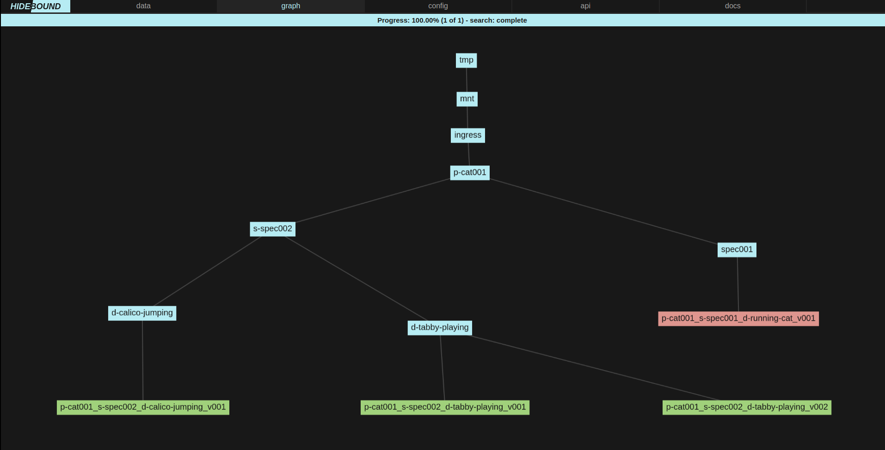
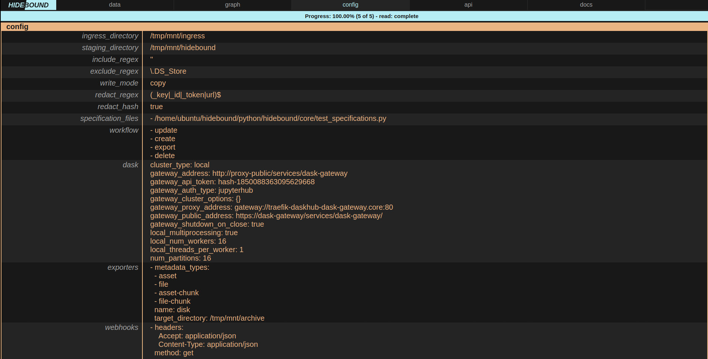
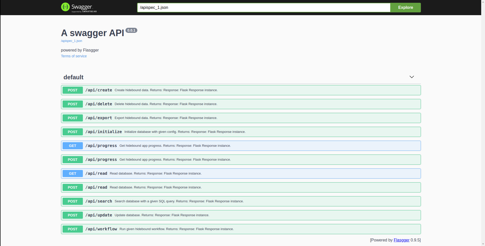
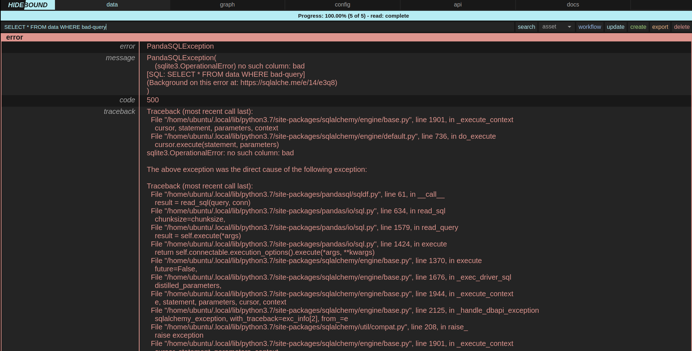

<p>
    <a href="https://www.linkedin.com/in/alexandergbraun" rel="nofollow noreferrer">
        
    </a>
    <a href="https://github.com/theNewFlesh" rel="nofollow noreferrer">
        
    </a>
    <a href="https://pypi.org/user/the-new-flesh" rel="nofollow noreferrer">
        
    </a>
    <a href="http://vimeo.com/user3965452" rel="nofollow noreferrer">
        
    </a>
    <a href="http://www.alexgbraun.com" rel="nofollow noreferrer">
        
    </a>
</p>

<!--  -->

[](https://github.com/theNewFlesh/hidebound/blob/master/LICENSE)
[](https://github.com/theNewFlesh/hidebound/blob/master/docker/config/pyproject.toml)
[](https://pypi.org/project/hidebound/)
[](https://pepy.tech/project/hidebound)

# Overview
A MLOps framework for generating ML assets and metadata.

Hidebound is an ephemeral database and asset framework used for generating,
validating and exporting assets to various data stores. Hidebound enables
developers to ingest arbitrary sets of files and output them as content and
generated metadata, which has been validated according to specifications they
define.

Assets are placed into an ingress directory, typically reserved for Hidebound
projects, and then processed by Hidebound. Hidebound extracts metadata from the
files and directories that make each asset according to their name, location and
file properties. This data comprises the entirety of Hidebound's database at any
one time.

See [documentation](https://thenewflesh.github.io/hidebound/) for details.

# Installation
## Python
`pip install hidebound`

## Docker
1. Install [docker-desktop](https://docs.docker.com/desktop/)
2. `docker pull thenewflesh/hidebound:prod-latest`

## Docker For Developers
1. Install [docker-desktop](https://docs.docker.com/desktop/)
2. Ensure docker-desktop has at least 4 GB of memory allocated to it.
4. `git clone git@github.com:theNewFlesh/hidebound.git`
5. `cd hidebound`
6. `chmod +x bin/hidebound`
7. `bin/hidebound docker-start`

The service should take a few minutes to start up.

Run `bin/hidebound --help` for more help on the command line tool.

### ZSH Setup

1. `bin/hidebound` must be run from this repository's top level directory.
2. Therefore, if using zsh, it is recommended that you paste the following line
    in your ~/.zshrc file:
    - `alias hidebound="cd [parent dir]/hidebound; bin/hidebound"`
    - Replace `[parent dir]` with the parent directory of this repository
3. Running the `zsh-complete` command will enable tab completions of the cli
   commands, in the next shell session.

   For example:
   - `hidebound [tab]` will show you all the cli options, which you can press
     tab to cycle through
   - `hidebound docker-[tab]` will show you only the cli options that begin with
     "docker-"

---

# Dataflow


Data begins as files on disk. Hidebound creates a JSON-compatible dict from
their name traits and file traits and then constructs an internal database table
from them, one dict per row. All the rows are then aggregated by asset, and
converted into JSON blobs. Those blobs are then validated according to their
respective specifications. Files from valid assets are then copied or moved into
Hidebound's content directory, according to their same directory structure and
naming. Metadata is written to JSON files inside Hidebound's metadata directory.
Each file's metadata is written as a JSON file in /hidebound/metadata/file, and
each asset's metadata (the aggregate of its file metadata) is written to
/hidebound/metadata/asset. From their exporters, can export the valid
asset data and its accompanying metadata to various locations, like an AWS S3
bucket.

# Workflow
The acronynm to remember for workflows is **CRUDES**: create, read, update,
delete, export and search. Those operations constitue the main functionality
that Hidebound supports.

## *Create Asset*
For example, an asset could be an image sequence, such as a directory full of
PNG files, all of which have a frame number, have 3 (RGB) channels, and are 1024
pixels wide by 1024 pixels tall. Let's call the specification for this type of
asset "spec001". We create an image sequence of a cat running, and we move it
into the Hidebound projects directory.

## *Update*


We call the update function via Hidebound's web app. Hidebound creates
a new database based upon the recursive listing of all the files within said
directory. This database is displayed to us as a table, with one file per row.
If we choose to group by asset in the app, the table will display one asset per
row. Hidebound extracts metadata from each filename (not any directory name) as
well as from the file itself. That metadata is called file_traits. Using only
information derived from filename and file traits, Hidebound determines which
files are grouped together as a single asset and the specification of that
asset. Asset traits are then derived from this set of files (one or more).
Finally, Hidebound validates each asset according to its determined
specification. All of this data is displayed as a table within the web app.
Importantly, all of the errors in filenames, file traits and asset traits are
included.

## *Review Graph*

If we click on the graph tab, we are greeted by a hierarchical graph of all our
assets in our project directory. Our asset is red, meaning it's invalid. Valid
asset's are green, and all other files and directories, including parent
directories, are cyan.

## *Diagnose and Repair*
We flip back to the data tab. Using table within it, we search (via SQL) for our
asset within Hidebound's freshly created database. We see an error in one of the
filenames, conveniently displayed in red text. The descriptor in one orf our
filenames has capital letters in it. This violates Hidebound's naming
convention, and so we get an error. We go and rename the file appropriately and
call update again.  Our asset is now valid. The filenames are correct and we can
see in the height and width columns, that it's 1024 by 1024 and the channels
column says it has three.

## *Create*
Next we click the create button. For each valid asset, Hidebound generates file
and asset metadata as JSON files within the hidebound/metadata directory.
Hidebound also copies or moves, depending on the config write mode, valid files
and directories into the hidebound/content directory. Hidebound/content and
hidebound/metadata are both staging directories used for generating a valid
ephemeral database. We now have a hidebound directory that looks like this
(unmentioned assets are collapsed behind the ellipses):
```shell
/tmp/hidebound
├── hidebound_config.yaml
│
├── specifications
│   └── specifications.py
│
├── data
│   ...
│   └── p-cat001
│       └── spec001
│           └── p-cat001_s-spec001_d-running-cat_v001
│               ├── p-cat001_s-spec001_d-running-cat_v001_c0000-0005_f0001.png
│               ├── p-cat001_s-spec001_d-running-cat_v001_c0000-0005_f0002.png
│               └── p-cat001_s-spec001_d-running-cat_v001_c0000-0005_f0003.png
│
├── metadata
    ├── asset
    │   ...
    │   └── a9f3727c-cb9b-4eb1-bc84-a6bc3b756cc5.json
    │
    └── file
        ...
        ├── 279873a2-bfd0-4757-abf2-7dc4f771f992.json
        ├── e50160ae-8678-40b3-b766-ee8311b1f0c9.json
        └── ea95bd79-cb8f-4262-8489-efe734c5f65c.json
```

## *Export*
The hidebound directories contain only valid assets. Thus, we are now free to
export this data to various data stores, such as AWS S3, MongoDB, and Girder.
Exporters are are defined within the exporters subpackage. They expect a
populated hidebound directory and use the files and metadata therein to export
hidebound data. Exporter configurations are stored in the hidebound config,
under the "exporters" key. Currently supported exporters include, disk, s3 and
girder. Below we can see the results of an export to Girder in the Girder web
app.


## *Delete*
Once this export process is complete, we may click the delete button. Hidebound
deletes the hidebound/content and hidebound/metdata directories and all their
contents. If write_mode in the Hidebound configuration is set to "copy", then
this step will merely delete data created by Hidebound. If it is set to "move",
then Hidebound will presumably delete, the only existing copy of out asset data
on the host machine. The delete stage in combination with the removal of assets
from the ingress directory is what makes Hidebound's database ephemeral.

## *Workflow*
`/api/workflow` is a API endpoint that initializes a database a with a given
config, and then calls each method from a given list. For instance, if you send
this data to `/api/workflow`:

```{config={...}, workflow=['update', 'create', 'export', 'delete']}```

A database instance will be created with the given config, and then that
instance will call its update, create, export and delete methods, in that order.

# Naming Convention
Hidebound is a highly opinionated framework that relies upon a strict but
composable naming convention in order to extract metadata from filenames. All
files and directories that are part of assets must conform to a naming
convention defined within that asset's specification.

In an over-simplified sense; sentences are constructions of words. Syntax
concerns how each word is formed, grammar concerns how to form words into a
sentence, and semantics concerns what each word means. Similarly, filenames can
be thought of as crude sentences. They are made of several words (ie fields).
These words have distinct semantics (as determines by field indicators). Each
word is constructed according to a syntax (ie indicator + token). All words are
joined together by spaces (ie underscores) in a particular order as determined
by grammar (as defined in each specification).

## *Syntax*
- Names consist of a series of fields, each separated by a single underscore
  “_”, also called a field separator.
- Periods, ".", are the exception to this, as it indicates file extension.
- Legal characters include and only include:

| Name             | Characters |  Use                      |
| ---------------- | ---------- | ------------------------- |
| Underscore       | _          | only for field separation |
| Period           | .          | only for file extensions  |
| Lowercase letter | a to z     | everything                |
| Number           | 0 to 9     | everything                |
| Hyphen           | -          | token separator           |

Fields are comprised of two main parts:

| Name             | Use                                                 |
| ---------------- | --------------------------------------------------- |
| Field indicator  | determines metadata key                             |
| Field token      | a set of 1+ characters that define the field's data |

---
## **Example Diagrams**
In our example filename:
`p-cat001_s-spec001_d-running-cat_v001_c0000-0005_f0003.png` the metadata will be:

```json
{
    "project": "cat001",
    "specification": "spec001",
    "descriptor": "running-cat",
    "version": 1,
    "coordinate": [0, 5],
    "frame": 3,
    "extension": "png",
}
```

The spec001 specification is derived from the second field of this filename:
```shell
      field   field
  indicator   token
          | __|__
         | |     |
p-cat001_s-spec001_d-running-cat_v001_c0000-0005_f0003.png
         |_______|
             |
           field
```

| Part             | Value                    |
| ---------------- | ------------------------ |
| Field            | s-spec001                |
| Field indicator  | s-                       |
| Field token      | spec001                  |
| Derived metadata | {specification: spec001} |

## *Special Field Syntax*

- Projects begin with 3 or 4 letters followed by 1 to 4 numbers
- Specifications begin with 3 or 4 letters followed by 3 numbers
- Descriptors begin with a letter or number and may also contain hyphens
- Descriptors may not begin with the words master, final or last
- Versions are triple-padded with zeros and must be greater than 0
- Coordinates may contain up to 3 quadruple-padded numbers, separated by hyphens
- Coordinates are always evaluated in XYZ order. For example: `c0001-0002-0003`
  produces `{x: 1, y: 2, z: 3}`.
- Each element of a coordinate may be equal to or greater than zero
- Frames are quadruple-padded and are greater than or equal to 0
- Extensions may only contain upper and lower case letters a to z and numbers 0
  to 9

## *Semantics*
Hidebound is highly opionated, especially with regards to its semantics. It
contains exactly seven field types, as indicated by their field indicators.
They are:

| Field         | Indicator |
| ------------- | --------- |
| project       | p-        |
| specification | s-        |
| descriptor    | d-        |
| version       | v         |
| coordinate    | c         |
| frame         | f         |
| extension     | .         |

## *Grammar*
The grammar is fairly simple:

  - Names are comprised of an ordered set of fields drawn from the seven above
  - All names must contain the specification field
  - All specification must define a field order
  - All fields of a name under that specification must occcur in its defined
    field order

Its is highly encouraged that fields be defined in the following order:

`project specification descriptor version coordinate frame extension`

The grammatical concept of field order here is one of rough encapsulation:

- Projects contain assets
- Assets are grouped by specification
- A set of assets of the same content is grouped by a descriptor
- That set of assets consists of multiple versions of the same content
- A single asset may broken into chunks, identified by 1, 2 or 3 coordinates
- Each chunk may consist of a series of files seperated by frame number
- Each file has an extension

## *Encouraged Lexical Conventions*
- Specifications end with a triple padded number so that they may be explicitely
  versioned. You redefine an asset specification to something slightly
  different, by copying its specification class, adding one to its name and
  change the class attributes in some way. That way you always maintain
  backwards compatibility with legacy assets.
- Descriptors are not a dumping ground for useless terms like wtf, junk, stuff,
  wip and test.
- Descriptors should not specify information known at the asset specification
  level, such as the project name, the generic content of the asset (ie image,
  mask, png, etc).
- Descriptors should not include information that can be known from the
  preceding tokens, such as version, frame or extension.
- A descriptor should be applicable to every version of the asset it designates.
- Use of hyphens in descriptors is encouraged.
- When in doubt, hyphenate and put into the descriptor.

---
# Project Structure
Hidebound does not formally define a project structure. It merely stipulates
that assets must exist under some particular root directory. Each asset
specification does define a directory structure for the files that make up that
asset. Assets are divided into 3 types: file, sequence and complex. File defines
an asset that consists of a single file. Sequence is defined to be a single
directory containing one or more files. Complex is for assets that consist of an
arbitrarily complex layout of directories and files.

The following project structure is recommended:

```shell
project
    |-- specification
        |-- descriptor
            |-- asset      # either a file or directory of files and directories
                |- file
```

## For Example
```shell
/tmp/projects
└── p-cat001
    ├── s-spec002
    │   ├── d-calico-jumping
    │   │   └── p-cat001_s-spec002_d-calico-jumping_v001
    │   │       ├── p-cat001_s-spec002_d-calico-jumping_v001_f0001.png
    │   │       ├── p-cat001_s-spec002_d-calico-jumping_v001_f0002.png
    │   │       └── p-cat001_s-spec002_d-calico-jumping_v001_f0003.png
    │   │
    │   └── d-tabby-playing
    │       ├── p-cat001_s-spec002_d-tabby-playing_v001
    │       │   ├── p-cat001_s-spec002_d-tabby-playing_v001_f0001.png
    │       │   ├── p-cat001_s-spec002_d-tabby-playing_v001_f0002.png
    │       │   └── p-cat001_s-spec002_d-tabby-playing_v001_f0003.png
    │       │
    │       └── p-cat001_s-spec002_d-tabby-playing_v002
    │           ├── p-cat001_s-spec002_d-tabby-playing_v002_f0001.png
    │           ├── p-cat001_s-spec002_d-tabby-playing_v002_f0002.png
    │           └── p-cat001_s-spec002_d-tabby-playing_v002_f0003.png
    │
    └── spec001
        └── p-cat001_s-spec001_d-running-cat_v001
            ├── p-cat001_s-spec001_d-Running-Cat_v001_c0000-0005_f0002.png
            ├── p-cat001_s-spec001_d-running-cat_v001_c0000-0005_f0001.png
            └── p-cat001_s-spec001_d-running-cat_v001_c0000-0005_f0003.png
```

# Application
The Hidebound web application has five sections: data, graph, config, api and
docs.

## Data
The data tab is the workhorse of the Hidebound app.


Its functions are as follows:

* Search - Search the updated database's data via SQL
* Dropdown - Groups search results by file or asset
* Init - Initialized the database with the current config
* Update - Initializes and updates the database with the current config
* Create - Copies or moves valid assets to hidebound/content directory and
           creates JSON files in hidebound/metadata directory
* Delete - Deletes hidebound/content and hidebound/metadata directories

Prior to calling update, the application will look like this:


## Graph
The graph tab is used for visualizing the state of all the assets within a root
directory.


It's color code is as follows:

| Color | Meaning                     |
| ----- | --------------------------- |
| Cyan  | Non-asset file or directory |
| Green | Valid asset                 |
| Red   | Invalid asset               |

## Config
The config tab is used for uploading and writing Hidebound's configuration file.



## API
The API tab is really a link to Hidebound's REST API documentation.



## Docs
The API tab is really a link to Hidebound's github documentation.


## Errors
Hidebound is oriented towards developers and technically proficient users. It
displays errors in their entirety within the application.



# Configuration
Hidebound is configured via a configuration file or environment variables.

Hidebound configs consist of four main sections:

## Base
* ingress_directory - the directory hidebound parses for assets that comprise its database
* staging_directory - the staging directory valid assets are created in
* specification_files - a list of python specification files
* include_regex - filepaths in the root that match this are included in the database
* exclude_regex - filepaths in the root that match this are excluded from the database
* write_mode - whether to copy or move files from root to staging
* redact_regex - regular expression which matches config keys whose valuse are to be redacted
* redact_hash - whether to redact config values with "REDACTED" or a hash of the value
* workflow - order list of steps to be followed in workflow

## Dask
Default configuration of Dask distributed framework.

* cluster_type - dask cluster type
* num_partitions - number of partions for each dataframe
* local_num_workers - number of workers on local cluster
* local_threads_per_worker - number of threads per worker on local cluster
* local_multiprocessing - use multiprocessing for local cluster
* gateway_address - gateway server address
* gateway_proxy_address - **scheduler** proxy server address
* gateway_public_address - gateway server address, as accessible from a web browser
* gateway_auth_type - authentication type
* gateway_api_token - api token or password
* gateway_api_user - api user
* gateway_cluster_options - list of dask gateway cluster options
* gateway_shutdown_on_close - whether to shudown cluster upon close

## Exporters
Which exporters to us in the workflow.
Options include:

* s3
* disk
* girder

## Webhooks
Webhooks to call after the export phase has completed.

---

## Environment Variables
If `HIDEBOUND_CONFIG_FILEPATH` is set, Hidebound will ignore all other
environment variables and read the given filepath in as a yaml or json config
file.

| Variable                                 | Format | Portion                                                  |
| ---------------------------------------- | ------ | -------------------------------------------------------- |
| HIDEBOUND_CONFIG_FILEPATH                | str    | Entire Hidebound config file                             |
| HIDEBOUND_INGRESS_DIRECTORY              | str    | ingress_directory parameter of config                    |
| HIDEBOUND_STAGING_DIRECTORY              | str    | staging_directory parameter of config                    |
| HIDEBOUND_INCLUDE_REGEX                  | str    | include_regex parameter of config                        |
| HIDEBOUND_EXCLUDE_REGEX                  | str    | exclude_regex parameter of config                        |
| HIDEBOUND_WRITE_MODE                     | str    | write_mode parameter of config                           |
| HIDEBOUND_REDACT_REGEX                   | str    | redact_regex parameter of config                         |
| HIDEBOUND_REDACT_HASH                    | str    | redact_hash parameter of config                          |
| HIDEBOUND_WORKFLOW                       | yaml   | workflow paramater of config                             |
| HIDEBOUND_SPECIFICATION_FILES            | yaml   | specification_files section of config                    |
| HIDEBOUND_DASK_CLUSTER_TYPE              | str    | dask cluster type                                        |
| HIDEBOUND_DASK_NUM_PARTITIONS            | int    | number of partions for each dataframe                    |
| HIDEBOUND_DASK_LOCAL_NUM_WORKERS         | int    | number of workers on local cluster                       |
| HIDEBOUND_DASK_LOCAL_THREADS_PER_WORKER  | int    | number of threads per worker on local cluster            |
| HIDEBOUND_DASK_LOCAL_MULTIPROCESSING     | str    | use multiprocessing for local cluster                    |
| HIDEBOUND_DASK_GATEWAY_ADDRESS           | str    | gateway server address                                   |
| HIDEBOUND_DASK_GATEWAY_PROXY_ADDRESS     | str    | scheduler proxy server address                           |
| HIDEBOUND_DASK_GATEWAY_PUBLIC_ADDRESS    | str    | gateway server address, as accessible from a web browser |
| HIDEBOUND_DASK_GATEWAY_AUTH_TYPE         | str    | authentication type                                      |
| HIDEBOUND_DASK_GATEWAY_API_TOKEN         | str    | api token or password                                    |
| HIDEBOUND_DASK_GATEWAY_API_USER          | str    | api user                                                 |
| HIDEBOUND_DASK_GATEWAY_CLUSTER_OPTIONS   | yaml   | list of dask gateway cluster options                     |
| HIDEBOUND_DASK_GATEWAY_SHUTDOWN_ON_CLOSE | str    | whether to shudown cluster upon close                    |
| HIDEBOUND_EXPORTERS                      | yaml   | exporters section of config                              |
| HIDEBOUND_WEBHOOKS                       | yaml   | webhooks section of config                               |
| HIDEBOUND_TESTING                        | str    | run in test mode                                         |

---

## Config File
Here is a full example config with comments:
```yaml
ingress_directory: /mnt/storage/projects                                 # where hb looks for assets
staging_directory: /mnt/storage/hidebound                                # hb staging directory
include_regex: ""                                                        # include files that match
exclude_regex: "\\.DS_Store"                                             # exclude files that match
write_mode: copy                                                         # copy files from root to staging
                                                                         # options: copy, move
redact_regex: "(_key|_id|_token|url)$"                                   # regex matched config keys to redact
redact_hash: true                                                        # hash redacted values
workflow:                                                                # workflow steps
  - delete                                                               # clear staging directory
  - update                                                               # create database from ingress files
  - create                                                               # stage valid assets
  - export                                                               # export assets in staging
specification_files:                                                     # list of spec files
  - /mnt/storage/specs/image_specs.py
  - /mnt/storage/specs/video_specs.py
dask:
  cluster_type: local                                                    # Dask cluster type
                                                                         # options: local, gateway
  num_partitions: 16                                                     # number of partions for each dataframe
  local_num_workers: 16                                                  # number of workers on local cluster
  local_threads_per_worker: 1                                            # number of threads per worker on local cluster
  local_multiprocessing: true                                            # use multiprocessing for local cluster
  gateway_address: http://proxy-public/services/dask-gateway             # gateway server address
  gateway_proxy_address: gateway://traefik-daskhub-dask-gateway.core:80  # scheduler proxy server address
  gateway_public_address: https://dask-gateway/services/dask-gateway/    # gateway server address, as accessible from a web browser
  gateway_auth_type: jupyterhub                                          # authentication type
  gateway_api_token: token123                                            # api token or password
  gateway_api_user: admin                                                # api user
  gateway_cluster_options:                                               # list of dask gateway options
    - field: image                                                       # option field
      label: image                                                       # option label
      option_type: select                                                # options: bool, float, int, mapping, select, string
      default: "some-image:latest"                                       # option default value
      options:                                                           # list of choices if option_type is select
        - "some-image:latest"                                            # choice 1
        - "some-image:0.1.2"                                             # choice 2
  gateway_min_workers: 1                                                 # min dask gateway workers
  gateway_max_workers: 8                                                 # max dask gateway workers
  gateway_shutdown_on_close: true                                        # whether to shudown cluster upon close
exporters:                                                               # dict of exporter configs
  - name: disk                                                           # export to disk
    target_directory: /mnt/storage/archive                               # target location
    metadata_types:                                                      # options: asset, file, asset-chunk, file-chunk
      - asset                                                            # only asset and file metadata
      - file
    dask:                                                                # dask settings override
      num_workers: 8
      local_threads_per_worker: 2
  - name: s3                                                             # export to s3
    access_key: ABCDEFGHIJKLMNOPQRST                                     # aws access key
    secret_key: abcdefghijklmnopqrstuvwxyz1234567890abcd                 # aws secret key
    bucket: prod-data                                                    # s3 bucket
    region: us-west-2                                                    # bucket region
    metadata_types:                                                      # options: asset, file, asset-chunk, file-chunk
      - asset                                                            # drop file metadata
      - asset-chunk
      - file-chunk
    dask:                                                                # dask settings override
      cluster_type: gateway
      num_workers: 64
  - name: girder                                                         # export to girder
    api_key: eyS0nj9qPC5E7yK5l7nhGVPqDOBKPdA3EC60Rs9h                    # girder api key
    root_id: 5ed735c8d8dd6242642406e5                                    # root resource id
    root_type: collection                                                # root resource type
    host: http://prod.girder.com                                         # girder server url
    port: 8180                                                           # girder server port
    metadata_types:                                                      # options: asset, file
      - asset                                                            # only asset metadata
    dask:                                                                # dask settings override
      num_workers: 10
    dask:                                                                # dask settings override
      num_workers: 10
webhooks:                                                                # call these after export
  - url: https://hooks.slack.com/services/ABCDEFGHI/JKLMNO               # slack URL
    method: post                                                         # post this to slack
    timeout: 60                                                          # timeout after 60 seconds
    # params: {}                                                         # params to post (NA here)
    # json: {}                                                           # json to post (NA here)
    data:                                                                # data to post
      channel: "#hidebound"                                              # slack data
      text: export complete                                              # slack data
      username: hidebound                                                # slack data
    headers:                                                             # request headers
      Content-type: application/json
```

# Specification
Asset specifications are defined in python using the base classes found in
specification_base.py. The base classes are defined using the schematics
framework. Hidebound generates a single JSON blob of metadata for each file of
an asset, and then combines blob into a single blob with a list values per key.
Thus every class member defined with schematics is encapsulated with ListType.

## Example asset

Suppose we have an image sequence asset that we wish to define a specificqtion
for. Our image sequences consist of a directory containing 1 or 3 channel png
with frame numbers in the filename.

```shell
projects
    └── cat001
        └── raw001
            └── p-cat001_s-raw001_d-calico-jumping_v001
                ├── p-cat001_s-raw001_d-calico-jumping_v001_f0001.png
                ├── p-cat001_s-raw001_d-calico-jumping_v001_f0002.png
                └── p-cat001_s-raw001_d-calico-jumping_v001_f0003.png
```

## Example specification

We would write the following specification for such an asset.

```python
from schematics.types import IntType, ListType, StringType
import hidebound.core.validators as vd  # validates traits
import hidebound.core.traits as tr      # gets properties of files and file names
from hidebound.core.specification_base import SequenceSpecificationBase

class Raw001(SequenceSpecificationBase):
    asset_name_fields = [  # naming convention for asset directory
        'project', 'specification', 'descriptor', 'version'
    ]
    filename_fields = [    # naming convention for asset files
        'project', 'specification', 'descriptor', 'version', 'frame',
        'extension'
    ]
    height = ListType(IntType(), required=True)  # heights of png images
    width = ListType(IntType(), required=True)   # widths of png images
    frame = ListType(
        IntType(),
        required=True,
        validators=[vd.is_frame]  # validates that frame is between 0 and 9999
    )
    channels = ListType(
        IntType(),
        required=True,
        validators=[lambda x: vd.is_in(x, [1, 3])]  # validates that png is 1 or 3 channel
    )
    extension = ListType(
        StringType(),
        required=True,
        validators=[
            vd.is_extension,
            lambda x: vd.is_eq(x, 'png')  # validates that image is png
        ]
    )
    file_traits = dict(
        width=tr.get_image_width,            # retrieves image width from file
        height=tr.get_image_height,          # retrieves image height from file
        channels=tr.get_num_image_channels,  # retrieves image channel number from file
    )
```

# Production CLI

Hidebound comes with a command line interface defined in command.py.

Its usage pattern is: `hidebound COMMAND [FLAGS] [-h --help]`

## Commands
| Command         | Description                                                               |
| --------------- | ------------------------------------------------------------------------- |
| bash-completion | Prints BASH completion code to be written to a _hidebound completion file |
| config          | Prints hidebound config                                                   |
| serve           | Runs a hidebound server                                                   |
| zsh-completion  | Prints ZSH completion code to be written to a _hidebound completion file  |

---

# Quickstart Guide
This repository contains a suite commands for the whole development process.
This includes everything from testing, to documentation generation and
publishing pip packages.

These commands can be accessed through:

  - The VSCode task runner
  - The VSCode task runner side bar
  - A terminal running on the host OS
  - A terminal within this repositories docker container

Running the `zsh-complete` command will enable tab completions of the CLI.
See the zsh setup section for more information.

## Command Groups

Development commands are grouped by one of 10 prefixes:

| Command    | Description                                                                        |
| ---------- | ---------------------------------------------------------------------------------- |
| build      | Commands for building packages for testing and pip publishing                      |
| docker     | Common docker commands such as build, start and stop                               |
| docs       | Commands for generating documentation and code metrics                             |
| library    | Commands for managing python package dependencies                                  |
| session    | Commands for starting interactive sessions such as jupyter lab and python          |
| state      | Command to display the current state of the repo and container                     |
| test       | Commands for running tests, linter and type annotations                            |
| version    | Commands for bumping project versions                                              |
| quickstart | Display this quickstart guide                                                      |
| zsh        | Commands for running a zsh session in the container and generating zsh completions |

## Common Commands

Here are some frequently used commands to get you started:

| Command           | Description                                               |
| ----------------- | --------------------------------------------------------- |
| docker-restart    | Restart container                                         |
| docker-start      | Start container                                           |
| docker-stop       | Stop container                                            |
| docs-full         | Generate documentation, coverage report, diagram and code |
| library-add       | Add a given package to a given dependency group           |
| library-graph-dev | Graph dependencies in dev environment                     |
| library-remove    | Remove a given package from a given dependency group      |
| library-search    | Search for pip packages                                   |
| library-update    | Update dev dependencies                                   |
| session-lab       | Run jupyter lab server                                    |
| state             | State of                                                  |
| test-dev          | Run all tests                                             |
| test-lint         | Run linting and type checking                             |
| zsh               | Run ZSH session inside container                          |
| zsh-complete      | Generate ZSH completion script                            |

---

# Development CLI
bin/hidebound is a command line interface (defined in cli.py) that
works with any version of python 2.7 and above, as it has no dependencies.
Commands generally do not expect any arguments or flags.

Its usage pattern is: `bin/hidebound COMMAND [-a --args]=ARGS [-h --help] [--dryrun]`

## Commands
The following is a complete list of all available development commands:

| Command                 | Description                                                         |
| ----------------------- | ------------------------------------------------------------------- |
| build-package           | Build production version of repo for publishing                     |
| build-prod              | Publish pip package of repo to PyPi                                 |
| build-publish           | Run production tests first then publish pip package of repo to PyPi |
| build-test              | Build test version of repo for prod testing                         |
| docker-build            | Build Docker image                                                  |
| docker-build-from-cache | Build Docker image from cached image                                |
| docker-build-prod       | Build production image                                              |
| docker-container        | Display the Docker container id                                     |
| docker-destroy          | Shutdown container and destroy its image                            |
| docker-destroy-prod     | Shutdown production container and destroy its image                 |
| docker-image            | Display the Docker image id                                         |
| docker-prod             | Start production container                                          |
| docker-pull-dev         | Pull development image from Docker registry                         |
| docker-pull-prod        | Pull production image from Docker registry                          |
| docker-push-dev         | Push development image to Docker registry                           |
| docker-push-dev-latest  | Push development image to Docker registry with dev-latest tag       |
| docker-push-prod        | Push production image to Docker registry                            |
| docker-push-prod-latest | Push production image to Docker registry with prod-latest tag       |
| docker-remove           | Remove Docker image                                                 |
| docker-restart          | Restart Docker container                                            |
| docker-start            | Start Docker container                                              |
| docker-stop             | Stop Docker container                                               |
| docs                    | Generate sphinx documentation                                       |
| docs-architecture       | Generate architecture.svg diagram from all import statements        |
| docs-full               | Generate documentation, coverage report, diagram and code           |
| docs-metrics            | Generate code metrics report, plots and tables                      |
| library-add             | Add a given package to a given dependency group                     |
| library-graph-dev       | Graph dependencies in dev environment                               |
| library-graph-prod      | Graph dependencies in prod environment                              |
| library-install-dev     | Install all dependencies into dev environment                       |
| library-install-prod    | Install all dependencies into prod environment                      |
| library-list-dev        | List packages in dev environment                                    |
| library-list-prod       | List packages in prod environment                                   |
| library-lock-dev        | Resolve dev.lock file                                               |
| library-lock-prod       | Resolve prod.lock file                                              |
| library-remove          | Remove a given package from a given dependency group                |
| library-search          | Search for pip packages                                             |
| library-sync-dev        | Sync dev environment with packages listed in dev.lock               |
| library-sync-prod       | Sync prod environment with packages listed in prod.lock             |
| library-update          | Update dev dependencies                                             |
| library-update-pdm      | Update PDM                                                          |
| quickstart              | Display quickstart guide                                            |
| session-lab             | Run jupyter lab server                                              |
| session-python          | Run python session with dev dependencies                            |
| session-server          | Runn application server inside Docker container                     |
| state                   | State of repository and Docker container                            |
| test-coverage           | Generate test coverage report                                       |
| test-dev                | Run all tests                                                       |
| test-fast               | Test all code excepts tests marked with SKIP_SLOWS_TESTS decorator  |
| test-lint               | Run linting and type checking                                       |
| test-prod               | Run tests across all support python versions                        |
| version                 | Full resolution of repo: dependencies, linting, tests, docs, etc    |
| version-bump-major      | Bump pyproject major version                                        |
| version-bump-minor      | Bump pyproject minor version                                        |
| version-bump-patch      | Bump pyproject patch version                                        |
| version-commit          | Tag with version and commit changes to master                       |
| zsh                     | Run ZSH session inside Docker container                             |
| zsh-complete            | Generate oh-my-zsh completions                                      |
| zsh-root                | Run ZSH session as root inside Docker container                     |

## Flags

| Short | Long      | Description                                          |
| ----- | --------- | ---------------------------------------------------- |
| -a    | --args    | Additional arguments, this can generally be ignored  |
| -h    | --help    | Prints command help message to stdout                |
|       | --dryrun  | Prints command that would otherwise be run to stdout |
