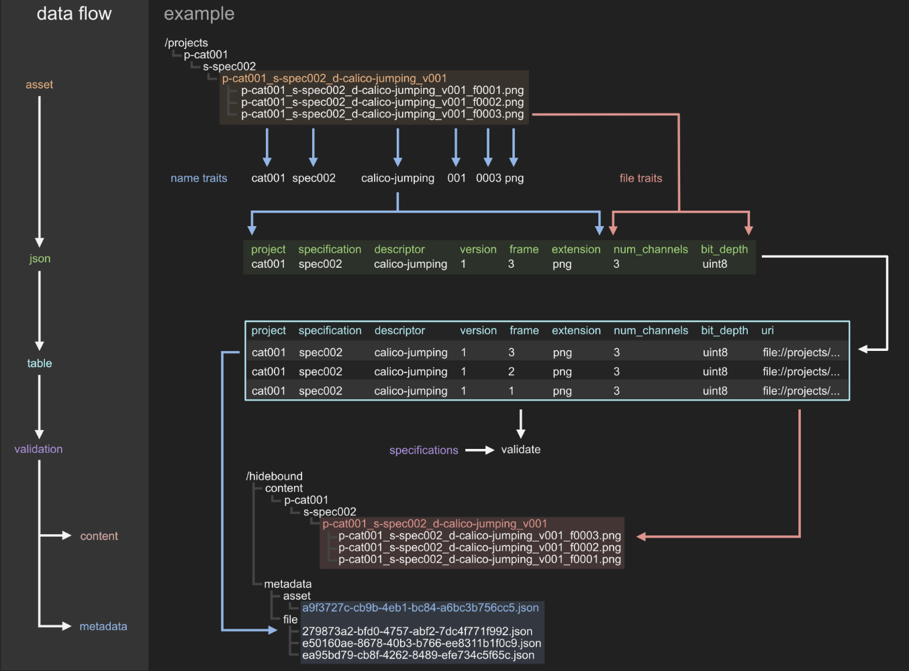
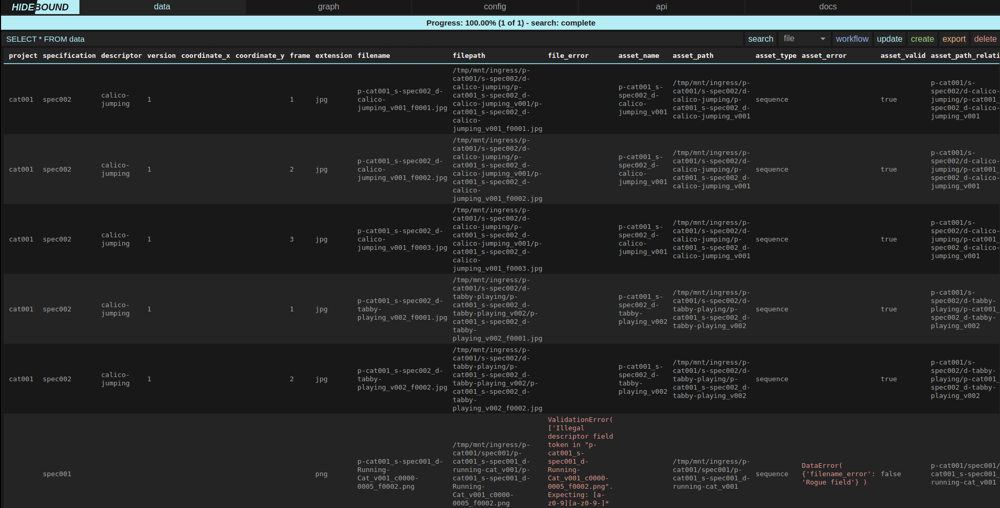
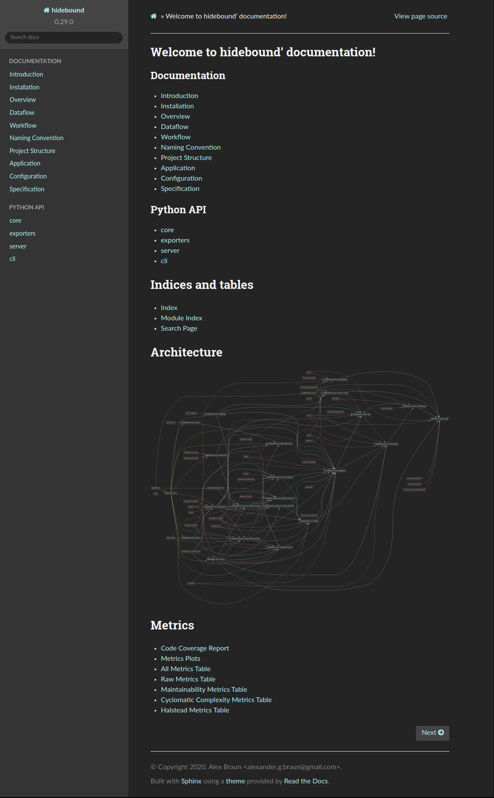

# Introduction
A local database service for converting directories of arbitrary files into
validated assets and derived metadata for export to databases like AWS S3 and
MongoDB.

See [documentation](https://thenewflesh.github.io/hidebound/) for details.

# Installation
### Python
`pip install hidebound`

### Docker
1. Install [docker](https://docs.docker.com/v17.09/engine/installation)
2. Install [docker-machine](https://docs.docker.com/machine/install-machine)
   (if running on macOS or Windows)
4. `docker pull thenewflesh/hidebound:latest`

### Docker For Developers
1. Install [docker](https://docs.docker.com/v17.09/engine/installation)
2. Install [docker-machine](https://docs.docker.com/machine/install-machine)
   (if running on macOS or Windows)
3. Ensure docker-machine has at least 4 GB of memory allocated to it.
4. `git clone git@github.com:theNewFlesh/hidebound.git`
5. `cd hidebound`
6. `chmod +x bin/hidebound`
7. `bin/hidebound start`

The service should take a few minutes to start up.

Run `bin/hidebound --help` for more help on the command line tool.

# Overview
Hidebound is a local, dockerized; database, asset framework, asset validation
and display service. Hidebound is not a competitor to databases like MongoDB,
Amazon Web Service's (AWS) S3, Postgres, etc. Hidebound enables developers to
ingest arbitrary sets of files and output them as validated assets and metadata
for consumption by databases like the aforementioned.

Hidebound is framework for validating, and extracting metadata from files and
directories according, to user defined specifications. Assets are placed into a
root directory (typically one reserved for Hidebound projects) and then
discovered, validated, extracted, and copied or moved by Hidebound.

# Dataflow


Data begins as files on disk. Hidebound creates a JSON-compatible dict from
their name traits and file traits and then constructs an internal database table
from them, one dict per row. All the rows are then aggregated by asset, and
converted into a JSON blobs. Those blobs are then validated according to their
respective specifications. Files from valid assets are then copied or moved into
Hidebound's data directory, according to their same directory structure and
naming. Metadata is written to JSON files inside Hidebound's metadata directory.
Each file's metadata is written as a JSON file in /hidebound/metadata/file, and
each asset's metadata (the aggregate of its file metadata) is written to
/hidebound/metadata/asset. From their exporters, can export the valid
asset data and its accompanying metadata to various locations, like an AWS S3
bucket.

# Workflow
The acronynm to remember for workflows is **CRUDES**: create, read, update,
delete, export and search. Those operations constitue the main functionality
that Hidebound supports.

### *Create Asset*
For example, an asset could be an image sequence, such as a directory full of
PNG files, all of which have a frame number, have 3 (RGB) channels, and are 1024
pixels wide by 1024 pixels tall. Let's call the specification for this type of
asset "spec001". We create an image sequence of a cat running, and we move it
into the Hidebound projects directory.

### *Update*


We call the update function via Hidebound's web app. Hidebound creates
a new database based upon the recursive listing of all the files within said
directory. This database is displayed to us as a table, with one file per row.
If we choose to group by asset in the app, the table will display one asset per
row. Hidebound extracts metadata from each filename (not any directory name) as
well as from the file itself. That metadata is called file_traits. Using only
information derived from filename and file traits, Hidebound determines which
files are grouped together as a single asset and the specification of that
asset. Asset traits are then derived from this set of files (one or more).
Finally, Hidebound validates each asset according to its determined
specification. All of this data is displayed as a table within the web app.
Importantly, all of the errors in filenames, file traits and asset traits are
included.

### *Review Graph*

If we click on the graph tab, we are greeted by a hierarchical graph of all our
assets in our project directory. Our asset is red, meaning it's invalid. Valid
asset's are green, and all other files and directories, including parent
directories, are cyan.

### *Diagnose and Repair*
We flip back to the data tab. Using table within it, we search (via SQL) for our
asset within Hidebound's freshly created database. We see an error in one of the
filenames, conveniently displayed in red text. The descriptor in one orf our
filenames has capital letters in it. This violates Hidebound's naming
convention, and so we get an error. We go and rename the file appropriately and
call update again.  Our asset is now valid. The filenames are correct and we can
see in the height and width columns, that it's 1024 by 1024 and the channels
column says it has three.

### *Create*
Next we click the create button. For each valid asset, Hidebound generates file
and asset metadata as JSON files within the hidebound/metadata directory.
Hidebound also copies or moves, depending on the config write mode, valid files
and directories into the hidebound/content directory. Thus we now have a
hidebound directory that looks like this (unmentioned assets are collapsed
behind the ellipses):
```
/tmp/hidebound
├── hidebound_config.json
│
├── specifications
│   └── specifications.py
│
├── data
│   ...
│   └── p-cat001
│       └── spec001
│           └── p-cat001_s-spec001_d-running-cat_v001
│               ├── p-cat001_s-spec001_d-running-cat_v001_c0000-0005_f0001.png
│               ├── p-cat001_s-spec001_d-running-cat_v001_c0000-0005_f0002.png
│               └── p-cat001_s-spec001_d-running-cat_v001_c0000-0005_f0003.png
│
├── metadata
    ├── asset
    │   ...
    │   └── a9f3727c-cb9b-4eb1-bc84-a6bc3b756cc5.json
    │
    └── file
        ...
        ├── 279873a2-bfd0-4757-abf2-7dc4f771f992.json
        ├── e50160ae-8678-40b3-b766-ee8311b1f0c9.json
        └── ea95bd79-cb8f-4262-8489-efe734c5f65c.json
```

### *Export*
This directory contains only valid assets and their associated metadata. We are
now free to export this data to various databases, such as AWS S3, MongoDB, and
Girder. Exporters are are defined within the exporters subpackage. They expect a
populated hidebound directory and use the files and metadata therein to export
hidebound data. Exporter configurations are stored in the hidebound conig, under
the "exporters" key. Below we can see the results of an export to Girder in the
Girder web app.


### *Delete*
Once this export process is complete, we may click the delete button. Hidebound
deletes the hidebound/content and hidebound/metdata directories and all their
contents. If write_mode in the Hidebound configuration is set to "copy", then
this step will merely delete data created by Hidebound. If it is set to "move",
then Hidebound will presumably delete, the only existing copy of out asset data
on the host machine.

### *Workflow*
`/api/workflow` is a API endpoint that initializes a database a with a given
config, and then calls each method from a given list. For instance, if you send
this data to `/api/workflow`:

```{config={...}, workflow=['update', 'create', 'export', 'delete']}```

A database instance will be created with the given config, and then that
instance will call its update, create, export and delete methods, in that order.

# Naming Convention
Hidebound is a highly opinionated framework that relies upon a strict but
composable naming convention in order to extract metadata from filenames. All
files and directories that are part of assets must conform to a naming
convention defined within that asset's specification.

In an over-simplified sense; sentences are constructions of words. Syntax
concerns how each word is formed, grammar concerns how to form words into a
sentence, and semantics concerns what each word means. Similarly, filenames can
be thought of as crude sentences. They are made of several words (ie fields).
These words have distinct semantics (as determines by field indicators). Each
word is constructed according to a syntax (ie indicator + token). All words are
joined together by spaces (ie underscores) in a particular order as determined
by grammar (as defined in each specification).

### *Syntax*
- Names consist of a series of fields, each separated by a single underscore
  “_”, also called a field separator.
- Periods, ".", are the exception to this, as it indicates file extension.
- Legal characters include and only include:

| Name             | Characters |  Use                      |
| ---------------- | ---------- | ------------------------- |
| Underscore       | _          | only for field separation |
| Period           | .          | only for file extensions  |
| Lowercase letter | a to z     | everything                |
| Number           | 0 to 9     | everything                |
| Hyphen           | -          | token separator           |

Fields are comprised of two main parts:

| Name             | Use                                                 |
| ---------------- | --------------------------------------------------- |
| Field indicator  | determines metadata key                             |
| Field token      | a set of 1+ characters that define the field's data |

---
### **Example Diagrams**
In our example filename:
`p-cat001_s-spec001_d-running-cat_v001_c0000-0005_f0003.png` the metadata will
be:
```
{
    'project': 'cat001',
    'specification': 'spec001',
    'descriptor': 'running-cat',
    'version': 1,
    'coordinate': [0, 5],
    'frame': 3,
    'extension': 'png',
}
```

The spec001 specification is derived from the second field of this filename:
```
      field   field
  indicator   token
          | __|__
         | |     |
p-cat001_s-spec001_d-running-cat_v001_c0000-0005_f0003.png
         |_______|
             |
           field
```

| Part             | Value                    |
| ---------------- | ------------------------ |
| Field            | s-spec001                |
| Field indicator  | s-                       |
| Field token      | spec001                  |
| Derived metadata | {specification: spec001} |

### *Special Field Syntax*

- Projects begin with 3 or 4 letters followed by 1 to 4 numbers
- Specifications begin with 3 or 4 letters followed by 3 numbers
- Descriptors begin with a letter or number and may also contain hyphens
- Descriptors may not begin with the words master, final or last
- Versions are triple-padded with zeros and must be greater than 0
- Coordinates may contain up to 3 quadruple-padded numbers, separated by hyphens
- Coordinates are always evaluated in XYZ order. For example: `c0001-0002-0003`
  produces `{x: 1, y: 2, z: 3}`.
- Each element of a coordinate may be equal to or greater than zero
- Frames are quadruple-padded and are greater than or equal to 0
- Extensions may only contain upper and lower case letters a to z and numbers 0
  to 9

### *Semantics*
Hidebound is highly opionated, especially with regards to its semantics. It
contains exactly seven field types, as indicated by their field indicators.
They are:

| Field         | Indicator |
| ------------- | --------- |
| project       | p-        |
| specification | s-        |
| descriptor    | d-        |
| version       | v         |
| coordinate    | c         |
| frame         | f         |
| extension     | .         |

### *Grammar*
The grammar is fairly simple:

  - Names are comprised of an ordered set of fields drawn from the seven above
  - All names must contain the specification field
  - All specification must define a field order
  - All fields of a name under that specification must occcur in its defined
    field order

Its is highly encouraged that fields be defined in the following order:

`project specification descriptor version coordinate frame extension`

The grammatical concept of field order here is one of rough encapsulation:

- Projects contain assets
- Assets are grouped by specification
- A set of assets of the same content is grouped by a descriptor
- That set of assets consists of multiple versions of the same content
- A single asset may broken into chunks, identified by 1, 2 or 3 coordinates
- Each chunk may consist of a series of files seperated by frame number
- Each file has an extension

### *Encouraged Lexical Conventions*
- Specifications end with a triple padded number so that they may be explicitely
  versioned. You redefine an asset specification to something slightly
  different, by copying its specification class, adding one to its name and
  change the class attributes in some way. That way you always maintain
  backwards compatibility with legacy assets.
- Descriptors are not a dumping ground for useless terms like wtf, junk, stuff,
  wip and test.
- Descriptors should not specify information known at the asset specification
  level, such as the project name, the generic content of the asset (ie image,
  mask, png, etc).
- Descriptors should not include information that can be known from the
  preceding tokens, such as version, frame or extension.
- A descriptor should be applicable to every version of the asset it designates.
- Use of hyphens in descriptors is encouraged.
- When in doubt, hyphenate and put into the descriptor.

# Project Structure
Hidebound does not formally define a project structure. It merely stipulates
that assets must exist under some particular root directory. Each asset
specification does define a directory structure for the files that make up that
asset. Assets are divided into 3 types: file, sequence and complex. File defines
an asset that consists of a single file. Sequence is defined to be a single
directory containing one or more files. Complex is for assets that consist of an
arbitrarily complex layout of directories and files.

The following project structure is recommended:

```
project
    |-- specification
        |-- descriptor
            |-- asset      # either a file or directory of files and directories
                |- file
```

#### For Example
```
/tmp/projects
└── p-cat001
    ├── s-spec002
    │   ├── d-calico-jumping
    │   │   └── p-cat001_s-spec002_d-calico-jumping_v001
    │   │       ├── p-cat001_s-spec002_d-calico-jumping_v001_f0001.png
    │   │       ├── p-cat001_s-spec002_d-calico-jumping_v001_f0002.png
    │   │       └── p-cat001_s-spec002_d-calico-jumping_v001_f0003.png
    │   │
    │   └── d-tabby-playing
    │       ├── p-cat001_s-spec002_d-tabby-playing_v001
    │       │   ├── p-cat001_s-spec002_d-tabby-playing_v001_f0001.png
    │       │   ├── p-cat001_s-spec002_d-tabby-playing_v001_f0002.png
    │       │   └── p-cat001_s-spec002_d-tabby-playing_v001_f0003.png
    │       │
    │       └── p-cat001_s-spec002_d-tabby-playing_v002
    │           ├── p-cat001_s-spec002_d-tabby-playing_v002_f0001.png
    │           ├── p-cat001_s-spec002_d-tabby-playing_v002_f0002.png
    │           └── p-cat001_s-spec002_d-tabby-playing_v002_f0003.png
    │
    └── spec001
        └── p-cat001_s-spec001_d-running-cat_v001
            ├── p-cat001_s-spec001_d-Running-Cat_v001_c0000-0005_f0002.png
            ├── p-cat001_s-spec001_d-running-cat_v001_c0000-0005_f0001.png
            └── p-cat001_s-spec001_d-running-cat_v001_c0000-0005_f0003.png
```

# Application
The Hidebound web application has five sections: data, graph, config, api and
docs.

### Data
The data tab is the workhorse of the Hidebound app.


Its functions are as follows:

* Search - Search the updated database's data via SQL
* Dropdown - Groups search results by file or asset
* Init - Initialized the database with the current config
* Update - Initializes and updates the database with the current config
* Create - Copies or moves valid assets to hidebound/content directory and
           creates JSON files in hidebound/metadata directory
* Delete - Deletes hidebound/content and hidebound/metadata directories

Prior to calling update, the application will look like this:


### Graph
The graph tab is used for visualizing the state of all the assets within a root
directory.


It's color code is as follows:

| Color | Meaning                     |
| ----- | --------------------------- |
| Cyan  | Non-asset file or directory |
| Green | Valid asset                 |
| Red   | Invalid asset               |

### Config
The config tab is used for uploading and writing Hidebound's configuration file.


Its functions are as follows:

| Name   | Function                                        |
| ------ | ----------------------------------------------- |
| Upload | Upload a config JSON file                       |
| Write  | Write config to hidebound/hidebound_config.json |

### API
The API tab is really a link to Hidebound's REST API documentation.


### Docs
The API tab is really a link to Hidebound's github documentation.



### Errors
Hidebound is oriented towards developers and technically proficient users. It
displays errors in their entirety within the application.


